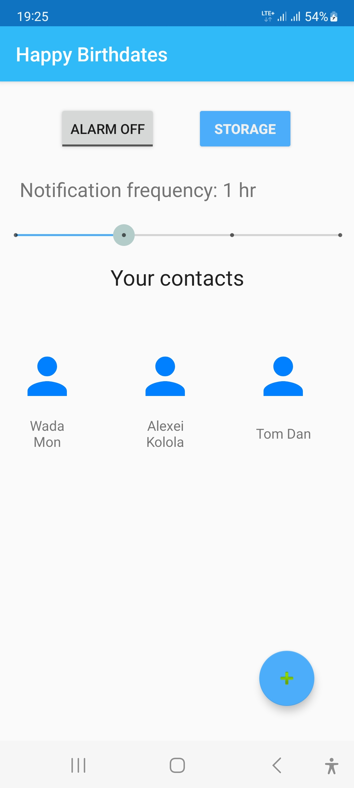
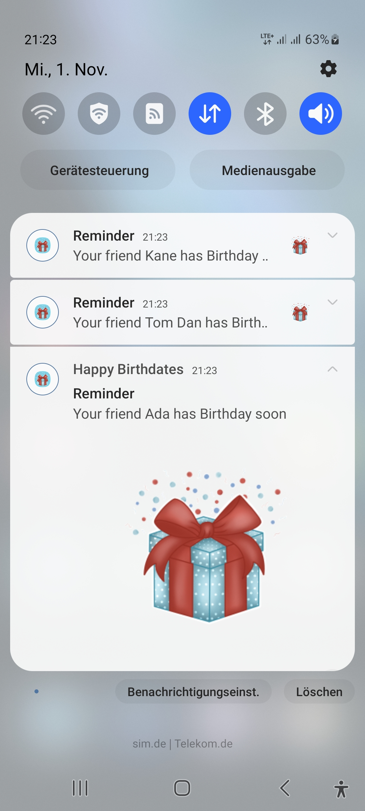
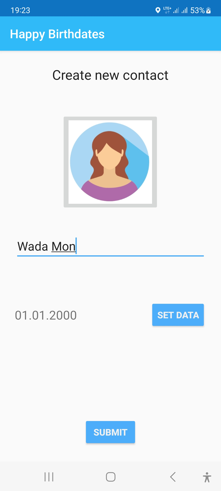
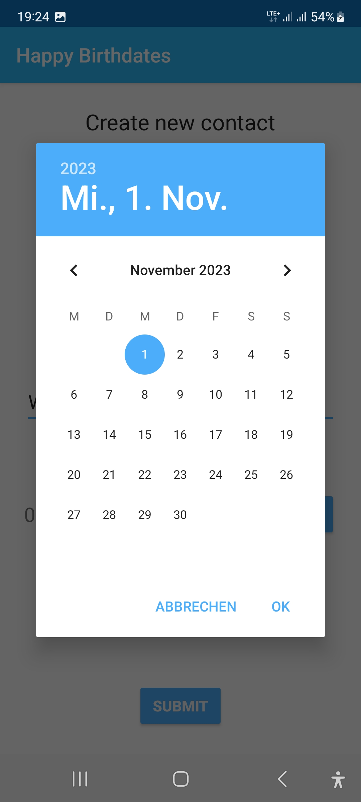
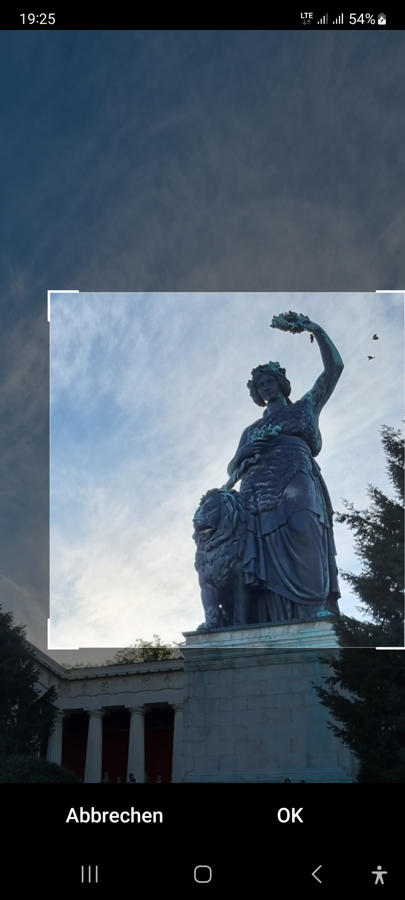
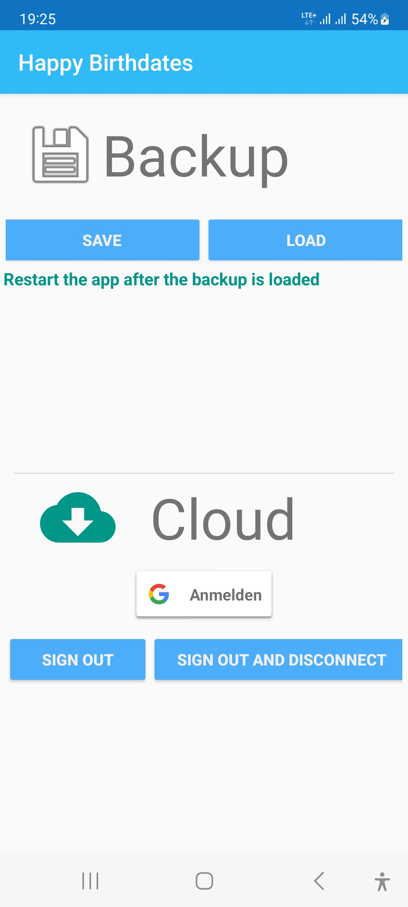

# Happy Birthdates

## Description

The simple Android application storing birthdays of contacts (e.g. people, organizations) saved by user.  
The contact list is editable and its backup copy can be stored on a Google Drive.  
A push notification, after activated, reminds about soon or today's contact birthday (2,1 days before and at the birthday).

> Img. Main menu page with contact list. Push 'Alarm' button to receive reminders

> Img. Push notifications about upcoming or today's birthdates

> Img. Contact creation page

> Img. Set of birthdate via the diplayed calendar

> Img. Chosen contact image editing

> Img. Backup page to store data in Cloud

## Download and run the application

The application is available via the following [link](https://drive.google.com/file/d/1DJ6BGoKAvuOi3oEqceIyjYj5J3CfBXOq/view?usp=sharing).  
Download the APK file into an Android smartphone and click to install.

## [License](http://www.apache.org/licenses/LICENSE-2.0)

Unless required by applicable law or agreed to in writing, software  distributed under the License is distributed on an "AS IS" BASIS, WITHOUT WARRANTIES OR CONDITIONS OF ANY KIND, either express or implied. See the License for the specific language governing permissions and limitations under the License.